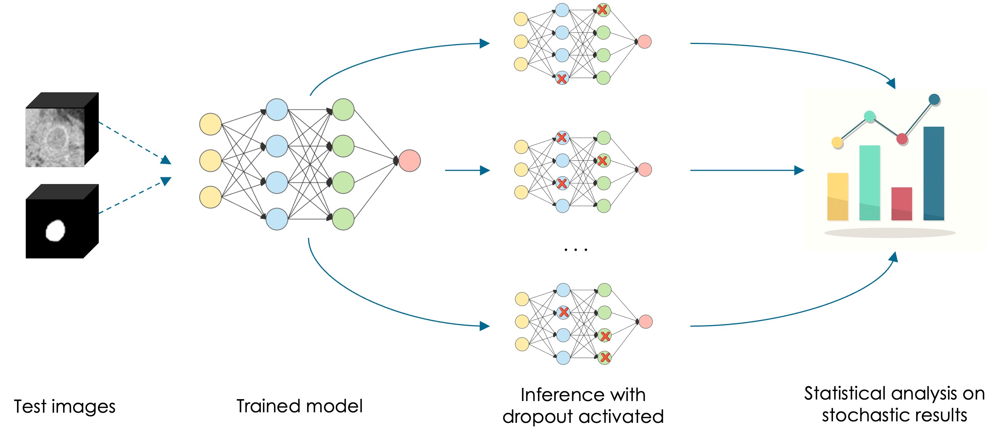

# Monte Carlo Dropout 🧠
This repository aims to explain and illustrate the **Monte Carlo Dropout** for the evaluation of model uncertainty. Two blog-posts will be soon available on our platform: `stAI tuned`. The [first one](https://staituned.com/learn/expert/30-days-of-machine-learning-engineering) covers the Bayesian inference and the Monte Carlo dropout, highlighting pros and cons of both approaches, whereas the second one explains, step by step, the pipeline of this project. 

<p align="center">
  
</p>

---

## How to run it 🛠

1. Clone the repository and move to the downloaded directory
```
git https://github.com/francescodisalvo05/monte-carlo-dropout.git
cd monte-carlo-dropout.git
```

2. Create a new virtual environment
```
python -m venv ./venv
source venv/bin/activate
pip install --upgrade pip
```

3. Install the requirements
```
pip install requirements.txt
```

4. Download the dataset from [Kaggle](https://www.kaggle.com/competitions/dogs-vs-cats) and copy it under the `dataset` folder. So you'll have all the images under `dataset/train`

5. Train your model (optional: there is already a checkpoint)
```
python train.py --root_path=<ROOT PATH OF THE IMAGES> \
                --output_path=<ROOT PATH OF THE PREDICTIONS> \
                --ckpt_path=<PATH FOR THE TRAINING CHECKPOINTS>
```

6. Make inference 
```
python inference.py --root_path=<ROOT PATH OF THE IMAGES>  \ 
                    --output_path=<ROOT PATH OF THE MC SAMPLES> \
                    --model_path=<CHECKPOINT FILEPATH>
```

7. Apply MC Dropout pipeline and gain statistics/insights
```
python mc_dropout.py --root_path=<ROOT PATH OF THE IMAGES> \
                     --output_path=<ROOT PATH OF THE PREDICTIONS> \
                     --model_path=<CHECKPOINT FILEPATH> \
                     --uncertainty_path=<ROOT PATH FOR THE UNCERTAINTY OUTCOMES (stats and images)>
```

> All the default arguments are tested and you can safely keep it for your experiments 

---

## Contacts 📩
I would me more than happy to receive comments or feedbacks. Feel free to reach me out on [LinkedIn](https://www.linkedin.com/in/francescodisalvo-pa/) or everywhere else! 


